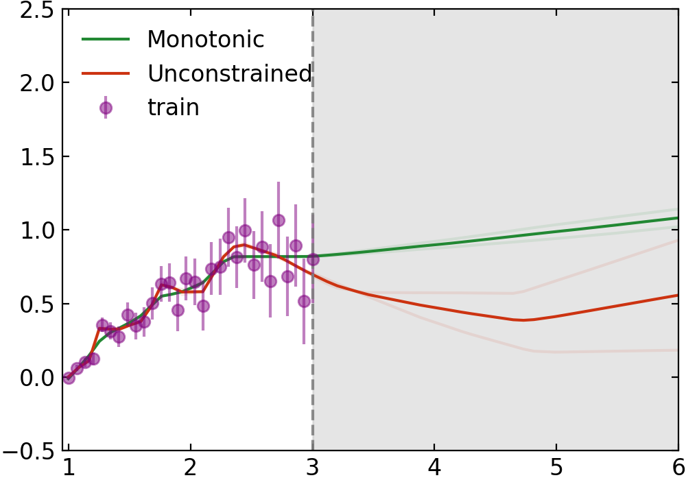
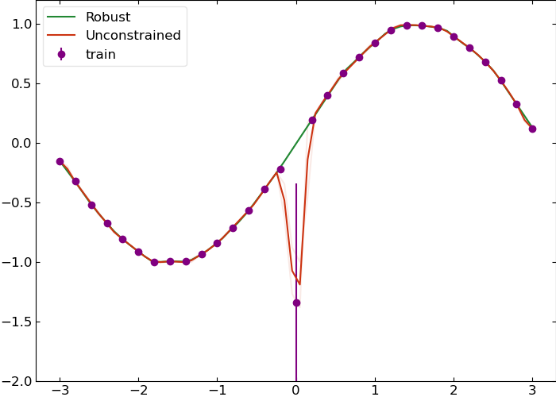
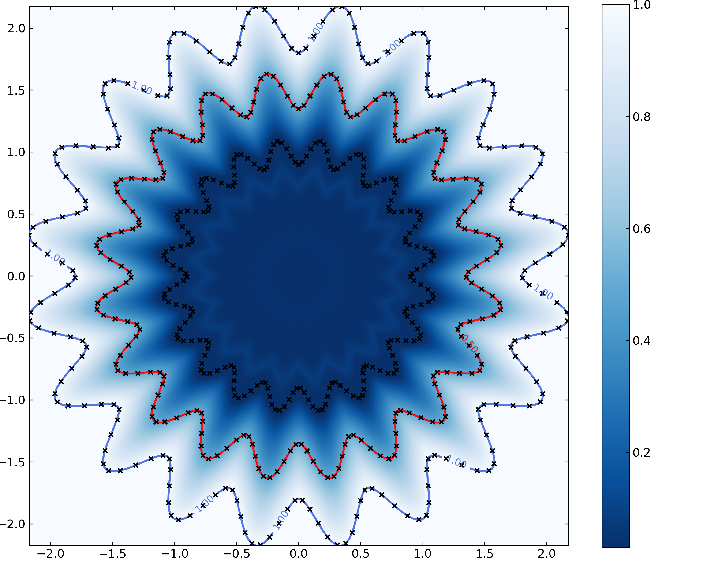

# Table of Contents
- [Lipschitz Monotonic Networks](#lipschitz-monotonic-networks)
- [Installation](#installation)
- [Usage](#usage) 
- [Examples](#examples)
    - [Monotonicity](#monotonicity)
    - [Robustness](#robustness)
    - [Lipschitz NNs can describe arbitrarily complex boundaries](#lipschitz-nns-can-describe-arbitrarily-complex-boundaries)
# Lipschitz Monotonic Networks

Implementation of Lipschitz Monotonic Networks, from the ICLR 2023 Submission: https://openreview.net/pdf?id=w2P7fMy_RH

The code here allows one to apply various weight constraints on torch.nn.Linear layers through the `kind` keyword. Here are the available weight norms: 
~~~ 
"one",      # |W|_1 constraint
"inf",      # |W|_inf constraint
"one-inf",  # |W|_1,inf constraint
"two-inf",  # |W|_2,inf constraint
~~~


# Installation
<div align="center">

| <center> **pip** | <center> **conda**|
|---|---|
|`pip install monotonenorm`<br> <center>[](https://badge.fury.io/py/monotonenorm)</center>| `conda install -c okitouni monotonenorm`<br> <center>[](https://anaconda.org/okitouni/monotonenorm)</center> |

</div>


</div>

# Usage
Here's an example showing two ways to create a Lipschitz constrained linear layer.
```python
from torch import nn
import monotonenorm as lmn

linear_by_norming = lmn.direct_norm(nn.Linear(10, 10), kind="one-inf") # |W|_1,inf constraint
linear_native = lmn.LipschitzLinear(10, 10, kind="one-inf") # |W|_1,inf constraint
```

 The function `lmn.direct_norm` can apply various weight constraints on torch.nn.Linear layers through the `kind` keyword and return a Lipschitz constrained linear layer. Alternatively, the code in `montonenorm/LipschitzMonotonicNetwork.py` contains several classes that can be used to create Lipschitz and Monotonic Layers directly.

The `LipschitzLinear` class is a linear layer with a Lipschitz constraint on its weights.

The `MonotonicLayer` class is a linear layer with a Lipschitz constraint on its weights and monotonicity constraints that can be specified for each input dimension, or for each input-output pair. For instance, suppose we want to model a 2 input x 3 output linear layer where the first output is monotonically increasing in the first input ([1, 0]), the second output is monotonically decreasing in the second input ([0, -1]), and the third output is monotonically increasing in the first input and monotonically decreasing in the second input ([1, -1]). We can do this by specifying the monotonicity constraints as follows:
```python
import monotonenorme as lmn

linear = lmn.MonotonicLayer(2, 3, monotone_constraints=[[1, 0], [0, 1], [1, -1]])
```
Using a 1D tensor for the constraint assumes that they are the same for each output dimension. By default, the code assumes all outputs are monotonically increasing with all inputs.


The `MonotonicWrapper` class is a wrapper around a module with a Lipschitz constant. It adds a term to the output of the module which enforces monotonicity constraints given by monotone_constraints. The class returns a module which is monotonic and Lipschitz with constant lipschitz_const.

The `SigmaNet` class is a deprecated class that is equivalent to the MonotonicWrapper class.

The `RMSNorm` class is a class that implements the RMSNorm normalization layer. It can help when training 
a model with many Lipschitz constrained layers.


# Examples
Checkout the `Examples` directory for more details. Specifically, `Examples/flower.py` shows how to train a Lipschitz Monotonic Network to regress on a complex decision boundary in 2D (under [Lipschitz NNs can describe arbitrarily complex boundaries](#lipschitz-nns-can-describe-arbitrarily-complex-boundaries)), and `Examples/Examples.ipynb` for the code used to make the plots under [Monotonicity](#monotonicity) and [Robustness](#robustness).

## Monotonicity
We will make a simple toy regression model to fit the following 1D function 
$$f(x) = log(x) + \epsilon(x)$$
where $\epsilon(x)$ is a gaussian noise term whose variance is linearly increasing in x. 
In this toy model we will assume that we have good reason to believe that the function we are trying to fit is monotonic (despite non-monotnic behavior of the noise). For example, we are building a trigger algorithm to discriminate between signal and background events. Rarer events are more likely to be signal and thus we should employ a network which is monotonic in some "rareness" feature. Another example could be a hiring classifier where (all else equal) higher school grades should imply better chances of being hired. 

Training a monotonic NN and an unconstrained NN on the purple points and evaluating the networks on a uniform grid gives the following result:



## Robustness
Now we will make a different toy model with one noisy data point. This will show that the Lipschitz continuous network is more robust against outliers than an unconstrained network because its gradient with respect to the input is bounded between -1 and 1. Additionally, it is more robust against adversarial attacks/data corruption for the same reason.



## Lipschitz NNs can describe arbitrarily complex boundaries
GroupSort weight constrained Neural Networks are universal approximators of Lipschitz continuous functions. Furthermore, they can describe arbitrarily complex decision boundaries in classification problems provided the proper objective function is used in training. In `Examples\flower.py` we provide code to regress on an example "complex" decision boundary in 2D. 

Here are the contour lines of the resulting network (along with the training points in black).


