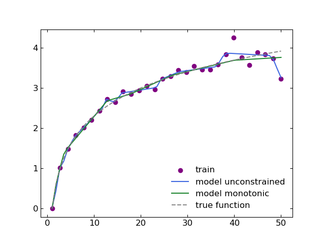
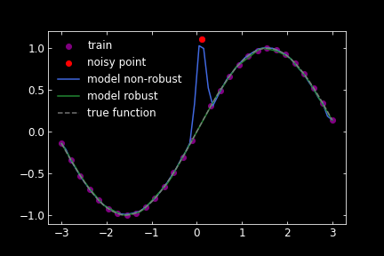
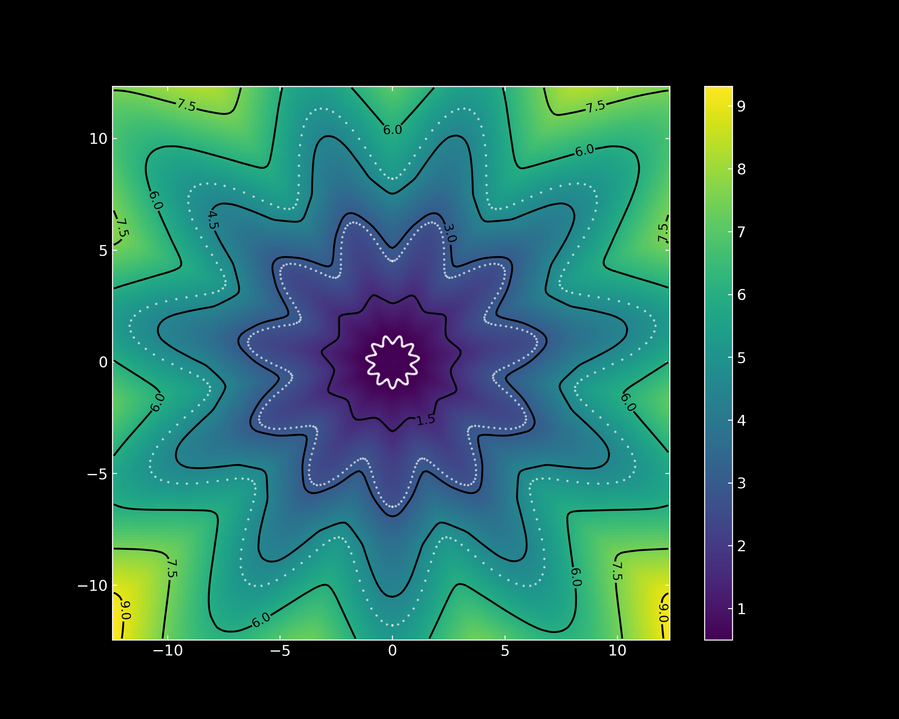

# MonotOneNorm

Implementation of Lipschitz Monotonic networks, implemented via weight constraints in the 1-Norm:  

NeurIPS ML4PS workshop extended abstract: https://arxiv.org/abs/2112.00038

The function direct_norm can also apply various weight constraints on torch.nn.Linear layers through the `kind` keyword. Here are the available weight norms: 
~~~ 
"one",  # |W|_1 constraint
"inf",  # |W|_inf constraint
"one-inf",  # |W|_1,inf constraint
"two-inf",  # |W|_2,inf constraint
~~~

# Examples
Checkout the `Examples` directory for more details:

## Monotonicity
We will make a simple toy regression model to fit the following 1D function f(x) = log(x) + \epsilon(x)
where \epsilon(x) is a gaussian noise term whose variance is linearly increasing in x. 
In this toy model we will assume that we have good reason to believe that the function we are trying to fit is monotonic (despite non-monotnic behavior of the noise). For example, we are building a trigger algorithm to discriminate between signal and background events. Rarer events are more likely to be signal and thus we should employ a network which is monotonic in some "rareness" feature. Another example could be a hiring classifier where (all else equal) higher school grades should imply better chances of being hired. 

Training a monotonic NN and an unconstrained NN on the purple points and evaluating the networks on a uniform grid gives the following result:

## Robustness
Now we will make a different toy model with one noisy data point. This will show that the Lipschitz continuous network is more robust against outliers than an unconstrained network because its gradient with respect to the input is bounded between -1 and 1. Additionally, it is more robust against adversarial attacks/data corruption for the same reason.

## Lipschitz NNs can describe arbitrarily complex boundaries
GroupSort weight constrained Neural Networks are universal approximators of Lipschitz continuous functions. Furthermore, they can describe arbitrarily complex decision boundaries in classification problems provided the proper objective function is used in training. In `Examples\flower.py` we provide code to regress on an example "complex" decision boundary in 2D. 

Here are the contour lines of the resulting networks (along with the training points in white).

